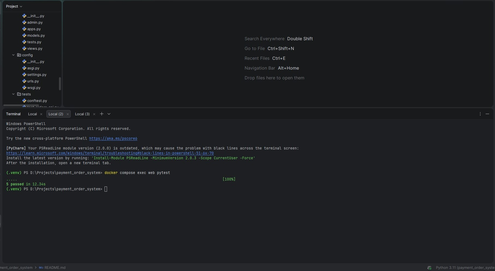

# Payment Order System (Django + DRF)

A production-style backend project implementing Orders, Payments, Webhooks, Idempotency, and Audit Logging.

## Features
- **Orders**
  - Create order with multiple items
  - Atomic calculation of `total_amount`
  - **Idempotency** via `(user, idempotency_key)` unique constraint
- **Payments**
  - Initiate payment for an order
  - **Idempotency** via `(user, provider, idempotency_key)` unique constraint
- **Webhooks**
  - Provider webhook endpoint updates Payment + Order status
  - **Idempotency** via `(provider, event_id)` unique constraint
  - **Security**: HMAC SHA256 signature + timestamp tolerance (replay protection)
- **AuditLog**
  - Stores important events like webhook processing

## Status Flow
### Order
- `DRAFT` → `PENDING_PAYMENT` → `PAID`
- `FAILED/CANCELLED payment` → `CANCELLED`

### Payment
- `INITIATED` → `SUCCEEDED` / `FAILED` / `CANCELLED`

## API Endpoints
### Create Order
`POST /api/orders/`

Example:
```json
{
  "currency": "USD",
  "idempotency_key": "ord-001",
  "items": [
    {"product_id": 1, "quantity": 2},
    {"product_id": 2, "quantity": 1}
  ]
}

Initiate Payment
POST /api/payments/
Example:

{
  "order_id": 1,
  "idempotency_key": "pay-001"
}

Payment Webhook
POST /api/webhooks/payment/
Headers:
X-Webhook-Timestamp: <unix>
X-Webhook-Signature: sha256=<hex>
Body example:

{
  "provider": "STRIPE",
  "event_id": "evt_001",
  "provider_payment_id": "stub_xxx",
  "status": "SUCCEEDED"
}

Environment Variables
SECRET_KEY
DEBUG (0/1)
WEBHOOK_SECRET
WEBHOOK_TOLERANCE_SECONDS (default: 300)

Run (Docker)
docker compose up --build
docker compose exec web python manage.py migrate
docker compose exec web python manage.py createsuperuser

Open:
Admin: http://127.0.0.1:8000/admin/
API: http://127.0.0.1:8000/api/

Tests
docker compose exec web pytest
Notes
This project focuses on backend architecture patterns:
idempotency
safe transactions
webhook processing
signature verification
audit logging


## Test Result
All tests passing:
